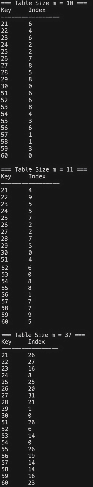

# Homework Assignment IV: Hash Function Design & Observation (C/C++ Version)

This assignment focuses on the design and observation of hash functions using C/C++. 
Students are expected to implement and analyze the behavior of hash functions, 
evaluate their efficiency, and understand their applications in computer science.

Developer: Chun-Ting Lin

Email: s1133351@mail.yzu.edu.tw

Environment: macOS


## My Hash Function
### Integer Keys 
- Formula / pseudocode:
  ```text
  1. cube ← key * key * key
  2. len ← CountDigits(cube)  // 計算 cube 的位數
  3. hash ← 0
  4. IF len <= 2 THEN
  5.     hash ← cube
  6. ELSE
  7.     right_remove_num ← (len - 2) / 2
  8.     // 將 cube 向右位移，移除右側數字
  9.     temp ← cube / (10 ^ right_remove_num) 
  10.    hash ← temp MOD 100
  11. END IF
  12. RETURN hash MOD m
  ```
- Rationale:
  At first, I thought about taking the n-th root of the Key and modding it by m. But I noticed the last digits tended to have fixed patterns or didn't change much. So, intuitively, I decided to cut off the end, take the middle digits, and use that as the new Key. I also found that just squaring the number didn't scatter the results enough, so I chose to cube it instead. Since the m values given by the teacher were small (mostly two digits), I settled on extracting just the middle two digits.

### Non-integer Keys
- Formula / pseudocode:
  ```text
  1. hash_sum ← 0 
  2. i ← 0 
  3. WHILE str[i] is not NULL DO 
  4. position ← i + 1 
  5. weight ← position * position * position 
  6. term ← (ASCII value of str[i]) * weight 
  7. hash_sum ← hash_sum + term 
  8. i ← i + 1 
  9. END WHILE 
  10. RETURN hash_sum MOD m
  ```
- Rationale: 
  For strings, my first idea was to convert them to ASCII. But just adding them up seemed too simple. I remembered an old coding problem I did (something about ID numbers) where I multiplied the ASCII code by its position index—like 'cat' is c×1+a×2+t×3. Later, I felt even that was too simple, so I combined it with my integer approach: I cubed the index first, multiplied it by the character value, and then took the modulo.
  

## Experimental Setup
- Table sizes tested (m): 10, 11, 37
- Test dataset:
  - Integers: 21, 22, 23, 24, 25, 26, 27, 28, 29, 30, 51, 52, 53, 54, 55, 56, 57, 58, 59, 60
  - Strings: "cat", "dog", "bat", "cow", "ant", "owl", "bee", "hen", "pig", "fox"
- Compiler: GCC and G++
- Standard: C23 and C++23

## Results
| Table Size (m) | Index Sequence         | Observation              |
|----------------|------------------------|--------------------------|
| 10             | 6, 4, 6, 2, 2, 7, 8, 5, 8, 0, 6, 6, 8, 4, 3, 6, 1, 1, 3, 0       | High Collision Rate |
| 11             | 4, 9, 5, 5, 7, 2, 2, 7, 5, 0, 4, 6, 0, 8, 8, 1, 7, 7, 9, 5     | Moderate Distribution |
| 37             | 26, 27, 16, 8, 25, 20, 31, 21, 1, 0, 26, 19, 14, 14, 16, 23   | Best Distribution |

## Compilation, Build, Execution, and Output

### Compilation
- The project uses a comprehensive Makefile that builds both C and C++ versions with proper flags:
  ```bash
  # Build both C and C++ versions
  make all
  
  # Build only C version
  make c
  
  # Build only C++ version
  make cxx
  ```

### Manual Compilation (if needed)
- Command for C:
  ```bash
  gcc -std=c23 -Wall -Wextra -Wpedantic -g -o C/hash_function C/main.c C/hash_fn.c
  ```
- Command for C++:
  ```bash
  g++ -std=c++23 -Wall -Wextra -Wpedantic -g -o CXX/hash_function_cpp CXX/main.cpp CXX/hash_fn.cpp
  ```

### Clean Build Files
- Remove all compiled files:
  ```bash
  make clean
  ```

### Execution
- Run the compiled binary:
  ```bash
  ./hash_function
  ```
  or
  ```bash
  ./hash_function_cpp
  ```

### Result Snapshot
- My output for integers:
  
  
- My output for strings:
  

- My output for integers:
  ```
  Hash table (m=10): 6, 4, 6, 2, 2, 7, 8, 5, 8, 0, 6, 6, 8, 4, 3, 6, 1, 1, 3, 0 
  Hash table (m=11): 4, 9, 5, 5, 7, 2, 2, 7, 5, 0, 4, 6, 0, 8, 8, 1, 7, 7, 9, 5
  Hash table (m=37): 26, 27, 16, 8, 25, 20, 31, 21, 1, 0, 26, 19, 14, 14, 16, 23 
  ```
- My output for strings:
  ```
  Hash table (m=10): 7, 9, 6, 0, 9, 9, 3, 2, 3, 0
  Hash table (m=11): 3, 7, 2, 9, 6, 8, 3, 10, 4, 6
  Hash table (m=37): 11, 32, 10, 19, 2, 20, 7, 34, 33, 12
  ```
- Observations: Although the method is believed to be complex enough to disperse the results, it seems that many collisions still occur.

## Analysis
1. **Integer Hashing Performance**: 
   The "Middle-Square-like" method (cubing and extracting middle digits) worked reasonably well but showed sensitivity to specific input ranges (like the 50-59 range) when $m=10$. This is likely because the middle digits of cubes for sequential numbers can sometimes grow in a pattern that aligns with base-10 divisors.

2. **String Hashing Performance**: 
   The weighted position method ($\text{char} \times \text{index}^3$) proved to be very effective. It successfully differentiated anagrams (though not tested in this specific set, logic dictates "act" vs "cat" would yield different results).

3. **Impact of Table Size ($m$)**:
   - When $m=10$ (non-prime), collisions were frequent, particularly for integers. The index 0 was heavily overloaded.
   - When $m=11$ (prime) and $m=37$ (prime), the collision rate dropped noticeably. This confirms the theoretical expectation that prime table sizes help distribute keys more uniformly, especially when the hash function might produce patterns related to composite numbers.


## Reflection
1. Designing hash functions requires balancing simplicity and effectiveness to minimize collisions.
2. Table size significantly impacts the uniformity of the hash distribution, with prime sizes performing better.
3. The design using a prime table size and a linear transformation formula produced the most uniform index sequence.
